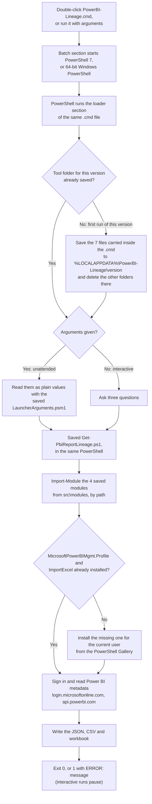

# PowerBI-Lineage.cmd

A Windows file you double-click, or run with arguments on a schedule. It lists, for every Power BI report, the
semantic model, tables, and the server, database, schema and table behind them, with the gateway. It only reads from
Power BI and changes nothing there. `PowerBI-Lineage.zip` holds the same `.cmd`, for email systems that block `.cmd`
files.

## How it works

It is one self-contained file. Nothing is downloaded except, if missing, the two PowerShell modules below.



Step by step:

1. **Start PowerShell.** The top of the file is a short batch section. It starts PowerShell 7 if installed, otherwise
   64-bit Windows PowerShell, and has it run the loader section of this same file.
2. **Save the tool's files.** The tool's 7 files are inside this file as plain text (open it in Notepad to read
   them). On the first run of this version the loader writes them to `%LOCALAPPDATA%\PowerBI-Lineage\<version>\`
   (`<version>` is a 12-character hash of the files) and leaves a `.complete` marker. Later runs of the same version
   reuse them. A new version deletes the other folders there.
   ```
   %LOCALAPPDATA%\PowerBI-Lineage\<version>\
     src\Get-PbiReportLineage.ps1
     src\Export-PbiLineageWorkbook.ps1
     src\modules\Prerequisites.psm1, PowerBIRest.psm1, MQueryLineage.psm1, RunProgress.psm1, LauncherArguments.psm1
   ```
   These files are **saved, not installed**: they are not registered with PowerShell and nothing else uses them.
3. **Run them.** The loader runs the saved `Get-PbiReportLineage.ps1` in the same PowerShell (with arguments, it first
   reads them with the saved `LauncherArguments.psm1`). The main script loads its four modules from the saved
   `src\modules` folder with `Import-Module <path>` and does the work.
4. **Outside modules.** `Prerequisites.psm1` looks for `MicrosoftPowerBIMgmt.Profile` (Microsoft) and `ImportExcel`
   (community). Only if one is missing does it install it from the PowerShell Gallery, for the current user only (no
   administrator rights needed). These two are the only things ever installed.

## Run it on your desktop

1. Double-click `PowerBI-Lineage.cmd`. If Windows warns about a downloaded file, choose **More info > Run anyway**.
2. Answer three questions: how to sign in (your own account, or a service principal with a secret or certificate),
   which reports (every workspace in the tenant, or only yours), and where to save (Enter for
   `Documents\Power BI Lineage`).
3. Watch the eight numbered steps, then open the workbook when asked.

It runs on the PowerShell built into Windows 10 and 11. Microsoft Excel is not needed to create the workbook.

## Run it unattended

For Task Scheduler, SQL Server Agent, Control-M or any job runner. With arguments it asks nothing, does not pause, and
exits `0` on success or `1` with `ERROR: <message>` on failure. It signs in as a service principal.

```bat
PowerBI-Lineage.cmd -Mode Admin -TenantId contoso.onmicrosoft.com -ClientId <app-id> -CertificateThumbprint <thumbprint> -ExcelPath "\\fileserver\bi"
```

With a client secret, have the job set `PBI_CLIENT_SECRET` from its credential store. The secret is refused on the
command line, where job logs and process lists could show it.

```bat
set PBI_CLIENT_SECRET=<secret>
PowerBI-Lineage.cmd -Mode Admin -TenantId contoso.onmicrosoft.com -ClientId <app-id> -ExcelPath "\\fileserver\bi"
```

Arguments are read as plain values; anything else, such as `$(...)`, is refused, never run.

| Argument | Default | Value |
|---|---|---|
| `-Mode` | `Auto` | `Admin` (whole tenant), `User` (workspaces the identity belongs to), or `Auto` (Admin if allowed, otherwise User). |
| `-TenantId`, `-ClientId` | | The service principal. |
| `-CertificateThumbprint` | | A certificate in the CurrentUser or LocalMachine personal store, instead of `PBI_CLIENT_SECRET`. |
| `-ConfigPath` | | A `config.json` with `tenantId` and `servicePrincipal` settings, instead of the three above. |
| `-ExcelPath` | `report-lineage.xlsx` in the JSON folder | A folder, a `.xlsx` file, or a `.csv` file (CSV only). |
| `-OutputPath` | The Excel file's folder, otherwise `Documents\Power BI Lineage` | Folder for the JSON. |
| `-WorkspaceId` | All | Comma-separated workspace IDs. |
| `-SkipExcel` | Off | JSON and CSV only. |
| `-IncludePersonalWorkspaces`, `-IncludeAutoDateTables`, `-SkipGatewayLookup`, `-SaveRawResponses`, `-Verbose` | Off | Optional switches. |
| `-ScanBatchSize` | `100` | Workspaces per admin scan, 1 to 100. |
| `/?` | | Show help. |

If the machine cannot reach the PowerShell Gallery, install the modules first:
`Install-Module MicrosoftPowerBIMgmt.Profile, ImportExcel -Scope AllUsers`.

## Permissions it needs

| Scope | Needs |
|---|---|
| Whole tenant (`Admin` mode) | A service principal in a security group allowed by the tenant setting **Service principals can access read-only admin APIs**, with no Power BI API permissions that need admin consent. The tenant settings **Enhance admin APIs responses with detailed metadata** and **Enhance admin APIs responses with DAX and mashup expressions** turned on. |
| Only its own workspaces (`User` mode) | **Contributor** or higher on each workspace, and the tenant setting **Dataset Execute Queries REST API** turned on. |

On a desktop you can also sign in with your own account: a **Fabric / Power BI Administrator** for the whole tenant, or
a workspace **Contributor** for your own workspaces.

## What it connects to

| Address | Why | When |
|---|---|---|
| `login.microsoftonline.com` | Sign-in | Every run |
| `api.powerbi.com` | Read Power BI metadata (read-only) | Every run |
| `www.powershellgallery.com` | Install `MicrosoftPowerBIMgmt.Profile` (Microsoft) or `ImportExcel` (community) | Only if the module is not already installed. Pre-install both and this is never contacted. |

It never contacts GitHub or any other source of code. It never reads report data, only metadata and Power Query code.

## What you get

| File | Contents |
|---|---|
| `PowerBI-Lineage_DDMMYYHHMM.xlsx` | Workbook: **Summary**, **All Lineage** (one row per report, table and source), **Source Objects** (each database object and the reports that use it), **Issues**, and one sheet per workspace. |
| `PowerBI-Lineage_DDMMYYHHMM.csv` | The All Lineage rows, in full. |
| `report-lineage-<date>\report-lineage.json` | Everything collected, untruncated. |

Main columns: `WorkspaceName`, `ReportName`, `DatasetName`, `TableName`, `SourceType`, `Server`, `Database`,
`Schema`, `SourceObject`, `GatewayName`, `IsSnowflakeConnection`, `ObjectOrigin`, `Notes`, `SourceExpression`.

File names above are for a folder as the output path, which gets new dated files each run. A `.xlsx` or `.csv` file path is replaced each run; a
`.csv` path writes the CSV only (no workbook, and `ImportExcel` is not needed).

## What it leaves on the computer

| Location | What | Kept |
|---|---|---|
| `%LOCALAPPDATA%\PowerBI-Lineage\<version>\` | The tool's 7 files and `.complete` | Until a different version runs |
| The output folder | The output files | Yours to manage |
| PowerShell module folders (current user) | `MicrosoftPowerBIMgmt.Profile`, `ImportExcel`, only if they were missing | Until removed |

## Troubleshooting

| Message or symptom | What to do |
|---|---|
| "Could not install the ... module automatically" | The network blocks the PowerShell Gallery. Install the modules as above. |
| "This account is not a Power BI / Fabric administrator" | Choose only your own workspaces (or `-Mode User`), or ask for the admin role. |
| "This service principal cannot use the Power BI admin APIs" | Check **Permissions it needs**, or use `-Mode User`. |
| Rows noting "No table metadata returned" | Turn on the two **Enhance admin APIs responses** tenant settings. |
| "Unattended runs sign in as a service principal" | Pass `-TenantId` and `-ClientId` with `-CertificateThumbprint`, or set `PBI_CLIENT_SECRET`. |
| The window closes at once, or scripts are blocked | Group Policy or AppLocker blocks PowerShell scripts. Ask IT. |

## Files in this folder

| File | What it is |
|---|---|
| `PowerBI-Lineage.cmd` | The file to run. |
| `PowerBI-Lineage.zip` | The same `.cmd`, zipped for email. The file inside can be double-clicked without extracting. |
| `README.md` | This page. |
| [`documentation.md`](documentation.md) | The detail: the file section by section, the files inside and their functions, how it is built. |
