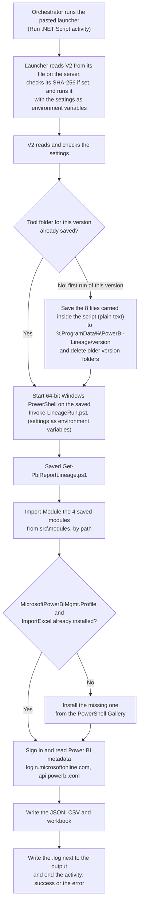

# PowerBI-Lineage.Orchestrator.V2.ps1

A System Center Orchestrator script that lists, for every Power BI report, the semantic model, tables, and the
server, database, schema and table behind them, with the gateway. It only reads from Power BI and changes nothing
there. Paste the whole file into one Run .NET Script activity.

V2 is the version to review. Every line that runs is in this file as plain text (142 KB, plain ASCII). It does
exactly what `PowerBI-Lineage.Orchestrator.ps1` (V1) does; V1 carries the same code compressed.

V2 is too large to paste into a Run .NET Script activity: Orchestrator fails with "Error initializing extension"
before any of it runs. So V2 is copied to the runbook server as a file, and the short
`PowerBI-Lineage.Orchestrator.V2.Launcher.ps1` (5 KB, plain text) is pasted into the activity. The launcher reads
V2 from the file and runs it, exactly as if it had been pasted.

## How it works

It is one self-contained script. Nothing is downloaded except, if missing, the two PowerShell modules below.



Step by step:

1. **Launcher.** The pasted launcher finds V2 at `$ScriptPath`, checks its SHA-256 if `$ScriptSha256` is set,
   sets the other settings as environment variables of the activity's process, and runs V2's text. V2 reads the
   settings from those variables (the settings inside the V2 file stay as placeholders) and checks them.
2. **Save the tool's files.** The tool's 8 files are inside this script, as readable plain text. On the first run of this
   version it writes them to `%ProgramData%\PowerBI-Lineage\<version>\` (`<version>` is a 12-character hash of
   the files) and leaves a `.complete` marker. Later runs of the same version find the marker and reuse the files. A
   new version deletes the older version folders.
   ```
   %ProgramData%\PowerBI-Lineage\<version>\
     Invoke-LineageRun.ps1
     src\Get-PbiReportLineage.ps1
     src\Export-PbiLineageWorkbook.ps1
     src\modules\Prerequisites.psm1, PowerBIRest.psm1, MQueryLineage.psm1, RunProgress.psm1, LauncherArguments.psm1
   ```
   These files are **saved, not installed**: they are not registered with PowerShell and nothing else on the server
   uses them.
3. **Run them.** It starts 64-bit Windows PowerShell on the saved `Invoke-LineageRun.ps1`, passing the settings as
   environment variables (never on a command line). That runs `Get-PbiReportLineage.ps1`, which loads its four
   modules from the saved `src\modules` folder with `Import-Module <path>` and does the work.
4. **Outside modules.** `Prerequisites.psm1` looks for `MicrosoftPowerBIMgmt.Profile` (Microsoft) and `ImportExcel`
   (community). Only if one is missing does it install it from the PowerShell Gallery for the service account. These
   two are the only things ever installed.
5. **Finish.** It waits for the run (180 minutes by default), writes a `.log` next to the output, and fails the
   activity with the reason if the run failed.

Why files at all: `Import-Module` loads modules from files, and the work must run in a separate 64-bit PowerShell,
because Orchestrator's own PowerShell is 32-bit (or PowerShell 7 in Orchestrator 2022 and 2025).

## Run it

1. Copy `PowerBI-Lineage.Orchestrator.V2.ps1` to a folder on the runbook server, e.g. `D:\Tools\PowerBI-Lineage\`.
   Do not edit it, and leave the settings inside it as placeholders. Allow only administrators to change the folder.
   If it arrived as `.txt` (email often blocks `.ps1`), rename it to exactly `PowerBI-Lineage.Orchestrator.V2.ps1`
   with **File Explorer > View > Show > File name extensions** on, so it does not end up as `...V2.ps1.txt`.
2. Optional: note its hash with `Get-FileHash D:\Tools\PowerBI-Lineage\PowerBI-Lineage.Orchestrator.V2.ps1`.
3. In **Runbook Designer**, drag a **new Run .NET Script** activity from **Activities > System** onto a runbook.
   Set **Type** to **PowerShell**.
4. Open `PowerBI-Lineage.Orchestrator.V2.Launcher.ps1` in Notepad, select all, copy, and paste it into the
   **Script** box. Do not paste V2 itself: it is too large and fails with "Error initializing extension".
5. At the top of the launcher, set `$ScriptPath` to the file's full path, `$ScriptSha256` to its hash (optional), and
   replace each `Required-...` placeholder (see **Settings**). Subscribe the secret rather than typing it (see
   **Keep the secret safe**).
6. Check the runbook in and run it.

Tested in System Center Orchestrator 2025; built for 2019 and 2022 as well, like V1. To update, replace the file on the server (and `$ScriptSha256`); the
launcher only needs pasting again when it changes.

## Settings

Fill these in at the top of the launcher. Values go between the quotes and must not contain a quote; with double
quotes, a value must not contain `$` either. A
setting left empty, or left as its `Required-...` placeholder, is read from the environment variable shown.

| Setting | Required | Default | Environment variable | Value |
|---|---|---|---|---|
| `$ScriptPath` | Yes | | `LINEAGE_SCRIPT_PATH` | Full path of `PowerBI-Lineage.Orchestrator.V2.ps1` on the runbook server. |
| `$ScriptSha256` | No | | | The file's SHA-256 (`Get-FileHash`). If set, the run stops when the file has changed. |
| `$TenantId` | Yes | | `LINEAGE_TENANT_ID` | Tenant ID or domain, e.g. `contoso.onmicrosoft.com`. |
| `$AppId` | Yes | | `LINEAGE_CLIENT_ID` | The service principal's application (client) ID. |
| `$ClientSecret` | This or `$CertificateThumbprint` | | `PBI_CLIENT_SECRET` | The client secret. See **Keep the secret safe**. |
| `$ExcelPath` | Yes | | `LINEAGE_EXCEL_PATH` | A folder, a `.xlsx` file or a `.csv` file (CSV only). |
| `$OutputFormat` | No | `Excel` | `LINEAGE_OUTPUT_FORMAT` | `Excel` (workbook and CSV) or `CSV`. |
| `$Mode` | No | `Admin` | `LINEAGE_MODE` | `Admin` (whole tenant), `User` (workspaces the app belongs to) or `Auto`. |
| `$WorkspaceIds` | No | All | `LINEAGE_WORKSPACE_IDS` | Comma-separated workspace IDs. |
| `$CertificateThumbprint` | This or `$ClientSecret` | | `LINEAGE_CERTIFICATE_THUMBPRINT` | A certificate in `LocalMachine\My`, instead of a secret. |
| `$TimeoutMinutes` | No | `180` | `LINEAGE_TIMEOUT_MINUTES` | Stop the run after this many minutes. |

## Keep the secret safe

Orchestrator stores activity scripts in its database in plain text. Instead of typing the secret:

- **Subscribe, do not type.** Typing a variable's name between the quotes, such as `{ClientSecretVariable}`, is plain
  text, not a subscription: the tool sends those characters as the secret and sign-in fails with
  "One or more errors occurred.". A real subscription shows as a link in the script box.

- create an **encrypted variable** in Runbook Designer, then select the text between the quotes of `$ClientSecret`,
  right-click, and choose **Subscribe > Variable**; or
- leave `$ClientSecret` as its placeholder and use a certificate (`$CertificateThumbprint`), installed with its private
  key in `LocalMachine\My`, readable by the Orchestrator Runbook Service account.

Keep activity-specific logging off for this runbook. The secret is passed to the run as an environment variable,
never on a command line, and the tool does not write it to any file or log.

## Permissions it needs

| Scope | Needs |
|---|---|
| Whole tenant (`Admin` mode) | A service principal in a security group allowed by the tenant setting **Service principals can access read-only admin APIs**, with no Power BI API permissions that need admin consent. The tenant settings **Enhance admin APIs responses with detailed metadata** and **Enhance admin APIs responses with DAX and mashup expressions** turned on. |
| Only its own workspaces (`User` mode) | **Contributor** or higher on each workspace, and the tenant setting **Dataset Execute Queries REST API** turned on. |

## Runbook server requirements

- **Modules:** to avoid any download, install them once in an elevated PowerShell:
  `Install-Module MicrosoftPowerBIMgmt.Profile, ImportExcel -Scope AllUsers` (`ImportExcel` is not needed for CSV only).
- **Access:** the Orchestrator Runbook Service account needs write access to the `$ExcelPath` folder.
- **Disk:** `%ProgramData%\PowerBI-Lineage` (falls back to `%TEMP%\PowerBI-Lineage` if it cannot be written).

## What it connects to

| Address | Why | When |
|---|---|---|
| `login.microsoftonline.com` | Sign-in | Every run |
| `api.powerbi.com` | Read Power BI metadata (read-only) | Every run |
| `www.powershellgallery.com` | Install `MicrosoftPowerBIMgmt.Profile` (Microsoft) or `ImportExcel` (community) | Only if the module is not already installed. Pre-install both and this is never contacted. |

It never contacts GitHub or any other source of code. It never reads report data, only metadata and Power Query code.

## What you get

| File | Contents |
|---|---|
| `PowerBI-Lineage_DDMMYYHHMM.xlsx` | Workbook: **Summary**, **All Lineage** (one row per report, table and source), **Source Objects** (each database object and the reports that use it), **Issues**, and one sheet per workspace. |
| `PowerBI-Lineage_DDMMYYHHMM.csv` | The All Lineage rows, in full. |
| `report-lineage-<date>\report-lineage.json` | Everything collected, untruncated. |

Main columns: `WorkspaceName`, `ReportName`, `DatasetName`, `TableName`, `SourceType`, `Server`, `Database`,
`Schema`, `SourceObject`, `GatewayName`, `IsSnowflakeConnection`, `ObjectOrigin`, `Notes`, `SourceExpression`.

File names above are for a folder as the output path, which gets new dated files each run. A `.xlsx` or `.csv` file path is replaced each run; a
`.csv` path writes the CSV only (no workbook, and `ImportExcel` is not needed).

Orchestrator runs also write `PowerBI-Lineage_DDMMYYHHMM.log` next to the output, because Orchestrator does not keep
the activity's console output.

## What it leaves on the server

| Location | What | Kept |
|---|---|---|
| The folder you chose, e.g. `D:\Tools\PowerBI-Lineage\` | `PowerBI-Lineage.Orchestrator.V2.ps1`, copied by you | Until you replace it |
| `%ProgramData%\PowerBI-Lineage\<version>\` | The tool's 8 files and `.complete` | Until a different version runs |
| `%TEMP%\PowerBI-Lineage-<run id>.out.txt`, `.err.txt` | The run's output while it runs | Deleted at the end of the run |
| The `$ExcelPath` folder | The output files and a `.log` | Yours to manage |
| PowerShell module folders | `MicrosoftPowerBIMgmt.Profile`, `ImportExcel`, only if they were missing | Until removed |

## Troubleshooting

| Message or symptom | What to do |
|---|---|
| "Error initializing extension" | V2 itself was pasted: paste the launcher instead. Otherwise drag a **new** Run .NET Script activity from **Activities > System**, set **Type** to **PowerShell** and paste the launcher again. |
| "PowerBI-Lineage.Orchestrator.V2.ps1 was not found at ..." | Copy V2 to the runbook server (not the Runbook Designer machine) and check `$ScriptPath`. Check the name is exactly `PowerBI-Lineage.Orchestrator.V2.ps1`, not `.txt` or `.ps1.txt`. The Orchestrator Runbook Service account needs read access. |
| "... has changed: its SHA-256 is ..." | The file differs from `$ScriptSha256`. Check where it came from, then update the hash or replace the file. |
| "The setting ... is required" or "has an invalid value" | Replace every `Required-...` placeholder. `$AppId` must be a GUID; `$ExcelPath` a folder, `.xlsx` or `.csv`. |
| `[2/8] Signing in ... failed` with "One or more errors occurred." | The secret is typed rather than subscribed (see **Keep the secret safe**), or the secret, app ID or tenant ID is wrong or the secret has expired. |
| "Could not install the ... module automatically" | The server cannot reach the PowerShell Gallery. Install the modules as in **Runbook server requirements**. |
| "This service principal cannot use the Power BI admin APIs" | Check **Permissions it needs**, or set `$Mode = 'User'`. |
| Rows noting "No table metadata returned" | Turn on the two **Enhance admin APIs responses** tenant settings. |
| The run fails | The reason is in the activity's error summary; the detail is in the `.log` next to the output. |

## For reviewers

| What you will see | Why |
|---|---|
| The launcher runs V2's text with `[scriptblock]::Create` | The same as pasting V2 into the activity. It runs only the file at `$ScriptPath`, and only after the SHA-256 check when `$ScriptSha256` is set. |
| Eight blocks of code inside the script, each `$files['<path>'] = @' ... '@` | The tool's files, word for word, listed in the header. Nothing is compressed or encoded. |
| Two lines shown as `#~'@` | A line starting with `'@` would end its block early (one each in `MQueryLineage.psm1` and `LauncherArguments.psm1`), so it is stored as `#~'@` and saved as `'@`. No other character is changed. |
| Files written to `%ProgramData%` | See **How it works**, step 2. Everything written comes from inside this script. |
| `-ExecutionPolicy Bypass` | The saved files are not signed. It applies to that one process and changes no policy. |
| A second PowerShell process | Orchestrator's PowerShell is 32-bit or PowerShell 7; the Power BI and Excel modules need 64-bit Windows PowerShell. |
| `Install-Module`, `Install-PackageProvider` | Only for a missing `MicrosoftPowerBIMgmt.Profile` or `ImportExcel` (and NuGet). Pre-install to rule this out. |
| `taskkill /T /F` | Stops the run if it passes `$TimeoutMinutes`. |
| `PSModulePath` changed for the run | Keeps PowerShell 7 module folders away from Windows PowerShell. Only the run's own process is affected. |
| Backticks | 16, all in the tool's own code (escape characters and line continuations in help examples). |

**Power BI calls.** `Admin` mode: `GET admin/groups?$top=1` (permission check), `GET admin/workspaces/modified`,
`POST admin/workspaces/getInfo` (starts a metadata scan; creates nothing), `GET admin/workspaces/scanStatus/{id}`,
`GET admin/workspaces/scanResult/{id}`. `User` mode: `GET groups`, `GET groups/{id}/reports`,
`GET groups/{id}/datasets`, `GET .../datasets/{id}`, `GET .../datasets/{id}/datasources`, and
`POST datasets/{id}/executeQueries` with only `INFO.TABLES()`, `INFO.PARTITIONS()`, `INFO.EXPRESSIONS()` and
`INFO.REFRESHPOLICIES()`. Both modes: `GET gateways`, `GET gateways/{id}/datasources/{id}`,
`GET .../reports/{id}/datasources`.

**What the output contains.** Workspace, report and model names, server and database names, and each table's Power
Query code, which can include SQL. No credentials and no report data.

**Checking V2 against V1.** Only the header note and the section that holds and saves the files differ; the settings
and the run section are identical. V1's compressed block decodes to the same files (see `documentation.md`).

**Status.** Tested in System Center Orchestrator 2025: the launcher pasted into a Run .NET Script activity runs V2 from
a file on the runbook server, end to end. Pasting V2 itself fails with "Error initializing extension" (it is too
large). The launcher also refuses a missing file or a changed hash.

## Files in this folder

| File | What it is |
|---|---|
| `PowerBI-Lineage.Orchestrator.V2.ps1` | The script. Copy it to the runbook server; do not paste it. |
| `PowerBI-Lineage.Orchestrator.V2.Launcher.ps1` | The short script to paste into the activity. |
| `README.md` | This page. |
| [`documentation.md`](documentation.md) | The detail: the script section by section, its functions, the files inside and their functions, how it is built. |
