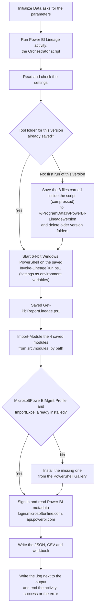

# PowerBI-Lineage.ois_export

A System Center Orchestrator runbook to import with Runbook Designer. It lists, for every Power BI report, the
semantic model, tables, and the server, database, schema and table behind them, with the gateway. It only reads from
Power BI and changes nothing there.

The runbook is `Power BI Report Lineage` in a folder `Power BI`: an **Initialize Data** activity that asks for the
settings, linked to a **Run .NET Script** activity holding the V1 Orchestrator script.

This file was generated to match the Runbook Designer export format. It has **not** been import-tested on an
Orchestrator server. If it fails, paste the Orchestrator script into a new Run .NET Script activity instead.

## How it works

It is one self-contained script. Nothing is downloaded except, if missing, the two PowerShell modules below.



Step by step:

1. **Settings.** The runbook's **Initialize Data** activity asks for the parameters and passes them to the script's
   settings (an empty one falls back to its environment variable).
2. **Save the tool's files.** The tool's 8 files are inside this script, gzip-compressed and base64-encoded. On the first run of this
   version it writes them to `%ProgramData%\PowerBI-Lineage\<version>\` (`<version>` is a 12-character hash of
   the files) and leaves a `.complete` marker. Later runs of the same version find the marker and reuse the files. A
   new version deletes the older version folders.
   ```
   %ProgramData%\PowerBI-Lineage\<version>\
     Invoke-LineageRun.ps1
     src\Get-PbiReportLineage.ps1
     src\Export-PbiLineageWorkbook.ps1
     src\modules\Prerequisites.psm1, PowerBIRest.psm1, MQueryLineage.psm1, RunProgress.psm1, LauncherArguments.psm1
   ```
   These files are **saved, not installed**: they are not registered with PowerShell and nothing else on the server
   uses them.
3. **Run them.** It starts 64-bit Windows PowerShell on the saved `Invoke-LineageRun.ps1`, passing the settings as
   environment variables (never on a command line). That runs `Get-PbiReportLineage.ps1`, which loads its four
   modules from the saved `src\modules` folder with `Import-Module <path>` and does the work.
4. **Outside modules.** `Prerequisites.psm1` looks for `MicrosoftPowerBIMgmt.Profile` (Microsoft) and `ImportExcel`
   (community). Only if one is missing does it install it from the PowerShell Gallery for the service account. These
   two are the only things ever installed.
5. **Finish.** It waits for the run (180 minutes by default), writes a `.log` next to the output, and fails the
   activity with the reason if the run failed.

Why files at all: `Import-Module` loads modules from files, and the work must run in a separate 64-bit PowerShell,
because Orchestrator's own PowerShell is 32-bit (or PowerShell 7 in Orchestrator 2022 and 2025).

## Import and run it

1. In Runbook Designer, right-click a folder and choose **Import**, then select `PowerBI-Lineage.ois_export`.
2. Clear **Import Orchestrator encrypted data** (the file contains none).
3. Open the **Power BI** folder and run **Power BI Report Lineage**, entering the parameters.

If the import fails, or the activity fails with "Error initializing extension", delete the imported runbook and paste
the Orchestrator script into a new Run .NET Script activity from **Activities > System** instead.

## Parameters

All are text. An empty value falls back to the environment variable shown.

| Parameter | Required | Default | Environment variable | Value |
|---|---|---|---|---|
| `Tenant ID` | Yes | | `LINEAGE_TENANT_ID` | Tenant ID or domain. |
| `App ID` | Yes | | `LINEAGE_CLIENT_ID` | The service principal's application (client) ID. |
| `Client secret` | This or `Certificate thumbprint` | | `PBI_CLIENT_SECRET` | The client secret. See **Keep the secret safe**. |
| `Excel path` | Yes | | `LINEAGE_EXCEL_PATH` | A folder, a `.xlsx` file or a `.csv` file (CSV only). |
| `Output format` | No | `Excel` | `LINEAGE_OUTPUT_FORMAT` | `Excel` or `CSV`. |
| `Mode` | No | `Admin` | `LINEAGE_MODE` | `Admin`, `User` or `Auto`. |
| `Workspace IDs` | No | All | `LINEAGE_WORKSPACE_IDS` | Comma-separated workspace IDs. |
| `Certificate thumbprint` | This or `Client secret` | | `LINEAGE_CERTIFICATE_THUMBPRINT` | A certificate in `LocalMachine\My`. |
| `Timeout minutes` | No | `180` | `LINEAGE_TIMEOUT_MINUTES` | Stop the run after this many minutes. |

## Keep the secret safe

A secret entered as the `Client secret` parameter is kept in the runbook's job history. For production, edit the
**Run Power BI Lineage** activity: select the `$ClientSecret` value, right-click, choose **Subscribe > Variable**, and
pick an **encrypted variable**. Or use `Certificate thumbprint` instead. Keep activity-specific logging off.

## Permissions it needs

| Scope | Needs |
|---|---|
| Whole tenant (`Admin` mode) | A service principal in a security group allowed by the tenant setting **Service principals can access read-only admin APIs**, with no Power BI API permissions that need admin consent. The tenant settings **Enhance admin APIs responses with detailed metadata** and **Enhance admin APIs responses with DAX and mashup expressions** turned on. |
| Only its own workspaces (`User` mode) | **Contributor** or higher on each workspace, and the tenant setting **Dataset Execute Queries REST API** turned on. |

## Runbook server requirements

- **Modules:** to avoid any download, install them once in an elevated PowerShell:
  `Install-Module MicrosoftPowerBIMgmt.Profile, ImportExcel -Scope AllUsers` (`ImportExcel` is not needed for CSV only).
- **Access:** the Orchestrator Runbook Service account needs write access to the `Excel path` folder.
- **Disk:** `%ProgramData%\PowerBI-Lineage` (falls back to `%TEMP%\PowerBI-Lineage` if it cannot be written).

## What it connects to

| Address | Why | When |
|---|---|---|
| `login.microsoftonline.com` | Sign-in | Every run |
| `api.powerbi.com` | Read Power BI metadata (read-only) | Every run |
| `www.powershellgallery.com` | Install `MicrosoftPowerBIMgmt.Profile` (Microsoft) or `ImportExcel` (community) | Only if the module is not already installed. Pre-install both and this is never contacted. |

It never contacts GitHub or any other source of code. It never reads report data, only metadata and Power Query code.

## What you get

| File | Contents |
|---|---|
| `PowerBI-Lineage_DDMMYYHHMM.xlsx` | Workbook: **Summary**, **All Lineage** (one row per report, table and source), **Source Objects** (each database object and the reports that use it), **Issues**, and one sheet per workspace. |
| `PowerBI-Lineage_DDMMYYHHMM.csv` | The All Lineage rows, in full. |
| `report-lineage-<date>\report-lineage.json` | Everything collected, untruncated. |

Main columns: `WorkspaceName`, `ReportName`, `DatasetName`, `TableName`, `SourceType`, `Server`, `Database`,
`Schema`, `SourceObject`, `GatewayName`, `IsSnowflakeConnection`, `ObjectOrigin`, `Notes`, `SourceExpression`.

File names above are for a folder as the output path, which gets new dated files each run. A `.xlsx` or `.csv` file path is replaced each run; a
`.csv` path writes the CSV only (no workbook, and `ImportExcel` is not needed).

Orchestrator runs also write `PowerBI-Lineage_DDMMYYHHMM.log` next to the output.

## What it leaves on the server

| Location | What | Kept |
|---|---|---|
| `%ProgramData%\PowerBI-Lineage\<version>\` | The tool's 8 files and `.complete` | Until a different version runs |
| `%TEMP%\PowerBI-Lineage-<run id>.out.txt`, `.err.txt` | The run's output while it runs | Deleted at the end of the run |
| The `Excel path` folder | The output files and a `.log` | Yours to manage |
| PowerShell module folders | `MicrosoftPowerBIMgmt.Profile`, `ImportExcel`, only if they were missing | Until removed |

## Files in this folder

| File | What it is |
|---|---|
| `PowerBI-Lineage.ois_export` | The runbook to import. |
| `README.md` | This page. |
| [`documentation.md`](documentation.md) | The detail: the export's structure, the script inside, the files inside and their functions, how it is built. |
